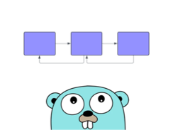

# go-saga

[](https://pkg.go.dev/github.com/tiagomelo/go-saga)



A tiny Go package that provides an implementation of the [Saga pattern](https://microservices.io/patterns/data/saga.html) for managing distributed transactions. 

The Saga pattern ensures that either all steps of a transaction succeed or all are compensated (rolled back) in case of failure, providing a way to maintain consistency across distributed systems.

## features

- **Saga Execution**: Execute a series of steps in sequence. If any step fails, the library compensates by rolling back all successfully completed steps.
- **In-Memory State Management**: By default, the state of each step is managed in-memory.
- **Custom State Management**: You can easily extend the library to use an external state manager, such as a database.
- **Flexible Configuration**: Configure the Saga with custom options, including setting a custom StateManager.

## available options

- `WithStateManager` sets a custom state manager

## installation

```bash
go get github.com/tiagomelo/go-saga
```

## usage

### with in-memory state management

```
package main

import (
	"context"
	"fmt"

	"github.com/tiagomelo/go-saga"
)

func main() {
	// Create a new Saga instance with the default in-memory state manager.
	s := saga.New()

	// Add steps to the Saga.
	s.AddStep(saga.NewStep("step1",
		func(ctx context.Context) error {
			fmt.Println("Executing Step 1")
			return nil
		},
		func(ctx context.Context) error {
			fmt.Println("Compensating Step 1")
			return nil
		},
	))

	s.AddStep(saga.NewStep("step2",
		func(ctx context.Context) error {
			fmt.Println("Executing Step 2")
			return fmt.Errorf("Step 2 failed")
		},
		func(ctx context.Context) error {
			fmt.Println("Compensating Step 2")
			return nil
		},
	))

	// Execute the Saga.
	if err := s.Execute(context.Background()); err != nil {
		fmt.Printf("Saga failed: %v\n", err)
	} else {
		fmt.Println("Saga completed successfully")
	}
}

```

### with a custom state manager

```
package main

import (
	"context"
	"fmt"

	"github.com/yourusername/go-saga"
)

// CustomStateManager is an example implementation of the StateManager interface.
// Replace this with your actual custom state manager implementation.
type CustomStateManager struct {
	// Implement the necessary fields and methods for your custom state management.
}

func (c *CustomStateManager) SetStepState(stepIndex int, success bool) error {
	// Implement logic to store the state of each step.
	return nil
}

func (c *CustomStateManager) StepState(stepIndex int) (bool, error) {
	// Implement logic to retrieve the state of each step.
	return false, nil
}

func main() {
	// Create a custom state manager.
	stateManager := &CustomStateManager{}

	// Create a new Saga instance with the custom state manager.
	s := saga.New(saga.WithStateManager(stateManager))

	// Add steps to the Saga.
	s.AddStep(saga.NewStep("step1",
		func(ctx context.Context) error {
			fmt.Println("Executing Step 1")
			return nil
		},
		func(ctx context.Context) error {
			fmt.Println("Compensating Step 1")
			return nil
		},
	))

	s.AddStep(saga.NewStep("step2",
		func(ctx context.Context) error {
			fmt.Println("Executing Step 2")
			return fmt.Errorf("Step 2 failed")
		},
		func(ctx context.Context) error {
			fmt.Println("Compensating Step 2")
			return nil
		},
	))

	// Execute the Saga.
	if err := s.Execute(context.Background()); err != nil {
		fmt.Printf("Saga failed: %v\n", err)
	} else {
		fmt.Println("Saga completed successfully")
	}
}

```

## unit tests

```
make test
```

## unit test coverage report

```
make coverage
```

## contributing

Contributions are welcome! If you find any issues or have suggestions for improvements, please open an issue or submit a pull request.

## license

This project is licensed under the MIT License. See the [LICENSE](LICENSE) file for more details.